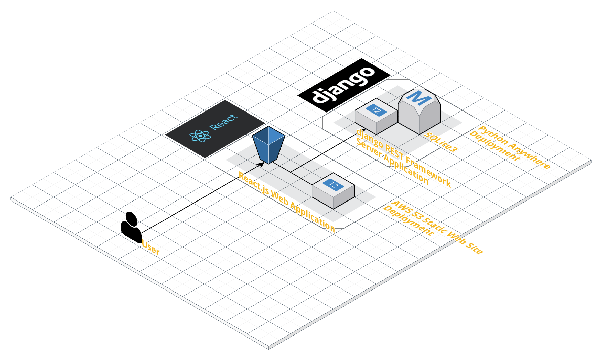

# Summer Coding 2019 Web Project<br/><small>Server With django Framework</small>

프로그래머스 주최 2019 썸머코딩 2차 과제 Server 파트 구현물.

주제 : TODO Application 만들기

## Implement Check

- 기능 요구사항
  - [x] 새로운 TODO(제목과 내용)를 작성할 수 있다.
  - [x] TODO 목록을 볼 수 있다.
  - [x] TODO 항목의 제목과 내용을 수정할 수 있다.
  - [x] TODO 항목을 삭제할 수 있다.
  - [x] 사용자의 선택에 의해 TODO에는 마감 기한을 넣을 수 있다.
  - [x] TODO 항목의 우선순위를 설정 및 조절할 수 있다.
  - [x] TODO 항목에 대한 완료 처리를 할 수 있다.
  - [x] 마감기한이 지난 TODO에 대해 알림을 노출할 수 있다.
- 성능 요구사항
  - [x] TODO 이용 시 발생하는 오류 사항을 최소화한다.
  - [x] 오류 발생 시 사용자가 이해하기 쉽게 표시한다.
  - [x] 다른 사람이 읽기 쉬운 코드를 작성한다.
  - [x] HTML/CSS에서 사용할 수 있는 최신 구조와 기술을 사용한다.
- 인터페이스 요구사항
  - [x] 직관적이고 의미 전달이 명확한 화면을 사용자에게 제공한다.

## Develop Stack

- Python 3.7
- django 2.1
- django REST Framework

## Relational Database Structure

데이터베이스는 단일 테이블로 구성되어 있습니다.

`TodoElement`

- `id` : Integer 타입. Auto Increment, Primary Key 제약 조건.
- `title` : VARCHAR(127) 타입. Not Null 제약 조건.
- `description` = TEXT 타입. Not Null 제약 조건.
- `priority` = VARCHAR(1) 타입. Not Null, ENUM('1', '2', '3', '4', '5') 제약 조건.
- `completed` = BOOLEAN 타입. Not Null 제약 조건. 기본 값은 `False`.
- `deadline` = Date Time 타입. Null 값 저장 가능.
- `created` = Date 타입. 웹에선 안 보여짐.
- `modified` = Date 타입. 웹에선 안 보여짐.

## Develop Environment

이 프로젝트는 다음과 같은 환경에서 제작 되었습니다.

- 운영체제 : Windows 10
- IDE : Visual Studio Code

## Deploy Environment



배포 환경은 Python Anywhere Web 을 사용하였습니다.

그리고 웹은 AWS S3 정적 페이지를 사용하여 배포했습니다.

## Execute Project

- Linux 를 기준 실행 방법은 다음과 같습니다.
- 기본 실행 port 는 8000 입니다.
- 기본 실행 host 는 127.0.0.1(localhost) 입니다.

1. Python 3 를 설치합니다. django 를 설치하기 위해 pip 도 설치합니다.

```
sudo apt install python3 python3-pip
```

2. 이 Git 을 Clone 한 이후, 아래 명령어로 필요한 패키지를 다운로드 받습니다.

```
$ pip install -r requirements.txt
```

3. 로컬 환경에서 서버는 아래 명령어로 구동하고, 실행할 수 있습니다.

```
$ python manage.py makemigrations
$ python manage.py migrate
$ python manage.py runserver
```

4. 프로젝트 중단을 원하면 터미널 창에서 Ctrl + C 를 입력하시길 바랍니다.

## Web Side References

Web 은 React.js Library 를 이용해서 연동하였습니다.

[참고하러 가기](https://github.com/tails5555/summer2019_todo_web)

## Author

- 강인성([tails5555](https://github.com/tails5555))